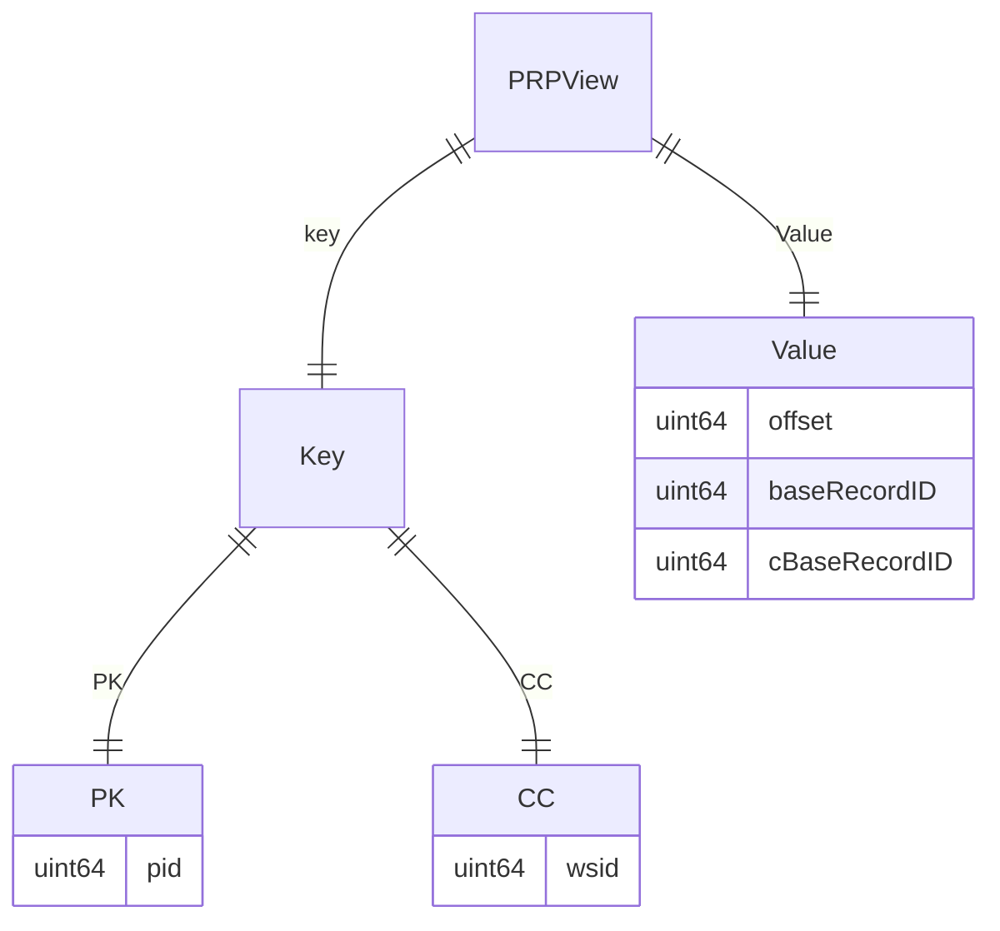
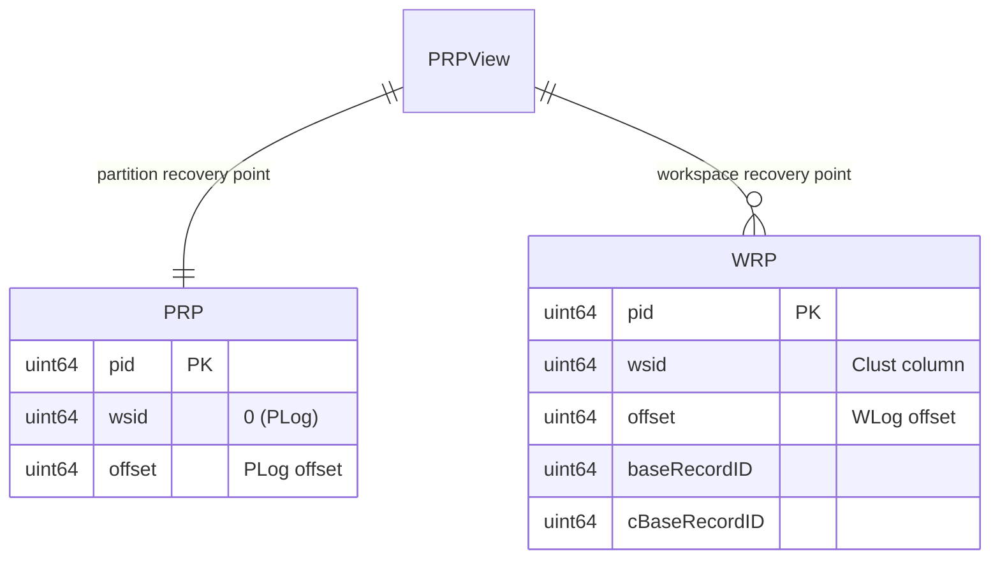

# Recovery Package

## Overview

The `recovery` package is responsible for managing partition recovery points (PRP) in the system. It provides functionality to store and retrieve recovery points for partitions and workspaces. This ensures that the system can recover to a consistent state after a failure.

## PRP View Structure

The PRP view is used to store recovery points for partitions and workspaces. It is defined as follows:

- **Partition Key**:
  - `pid` (Partition ID): `uint64`
- **Cluster Columns**:
  - `wsid` (Workspace ID): `uint64`
- **Value**:
  - `offset` (Offset of the last committed event): `uint64`
  - `baseRecordID` (Last base record ID): `uint64`
  - `cBaseRecordID` (Last CDoc (CRecord) base record ID): `uint64`

### Special Entry for Partition Log (PLog) Event

In addition to recovery points for workspaces, there is a special entry for the partition log (PLog) event:

- **Partition Key**:
  - `pid` (Partition ID): `uint64`
- **Cluster Columns**:
  - `wsid` (Workspace ID): `0`
- **Value**:
  - `offset` (Offset of the last committed event): `uint64`
  - `baseRecordID`: Not used
  - `cBaseRecordID`: Not used

### Structure Diagram

### Contains diagram

## Cassandra Maximum Partition Size

### Assumptions

- Each application partition handles up to 1,000 workspaces.
- Each workspace has a recovery point entry in the PRP view.
- There is one additional entry for the partition log (PLog) event.

### Estimation

1. **Size of Each Entry**:
   - `pid`: 8 bytes (uint64)
   - `wsid`: 8 bytes (uint64)
   - `offset`: 8 bytes (uint64)
   - `baseRecordID`: 8 bytes (uint64)
   - `cBaseRecordID`: 8 bytes (uint64)

   Total size per workspace entry: 8 + 8 + 8 + 8 + 8 = 40 bytes

2. **Size of PLog Entry**:
   - `pid`: 8 bytes (int64)
   - `wsid`: 8 bytes (int64)
   - `offset`: 8 bytes (int64)

   Total size of PLog entry: 8 + 8 + 8 = 24 bytes

3. **Total Size for 1,000 Workspaces**:
   - Number of workspace entries: 1,000
   - Total size of workspace entries: 1,000 * 40 bytes = 40,000 bytes = 40 KB
   - Total size including PLog entry: 40,000 bytes + 24 bytes = 40,024 bytes ≈ 40 KB

### Conclusion

The estimated size of a Cassandra partition for an application partition handling up to 1,000 workspaces, including the PLog entry, is approximately 40 KB, which is well within the typical maximum partition size limit of 20 MB.

## Maximum Number of Workspaces

### Assumptions

- The maximum size of a Cassandra partition should not exceed 20 MB.

### Estimation

1. **Maximum Partition Size**: 20 MB = 20 * 1024 * 1024 bytes = 20,971,520 bytes

2. **Number of Entries**:
   - Size per workspace entry: 40 bytes
   - Size of PLog entry: 24 bytes
   - Total size for workspace entries: 20,971,520 bytes - 24 bytes = 20,971,496 bytes
   - Maximum number of workspace entries: 20,971,496 bytes / 40 bytes ≈ 524,287 entries

### Conclusion

Given the maximum partition size of 20 MB, the system can handle approximately 524,287 workspaces per application partition, including the PLog entry, without exceeding the partition size limit.

---

This README provides an overview of the `recovery` package, including the structure of the PRP view, and estimates for Cassandra partition sizes and the maximum number of workspaces that can be handled.