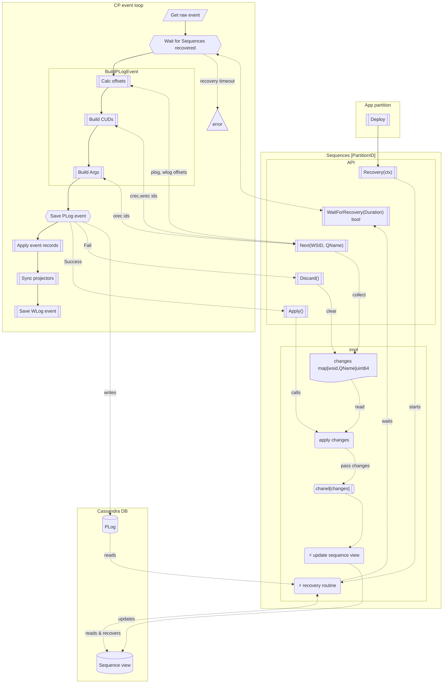
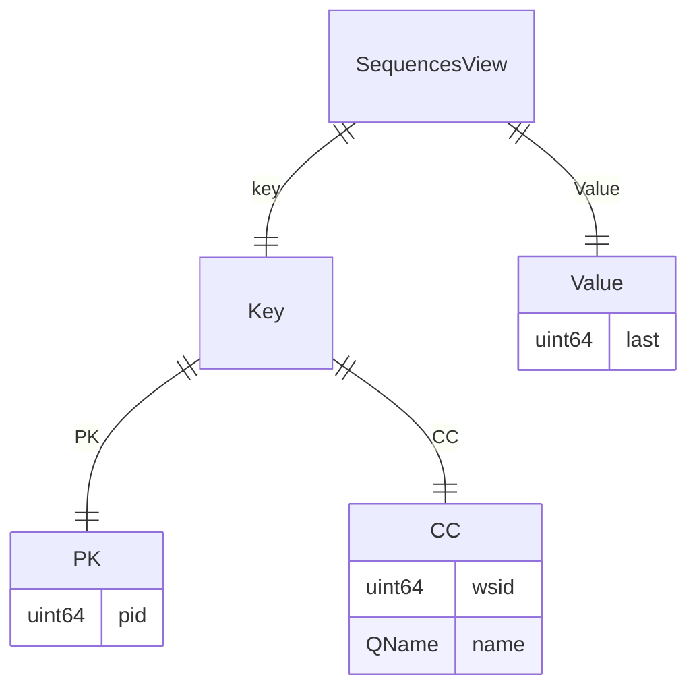
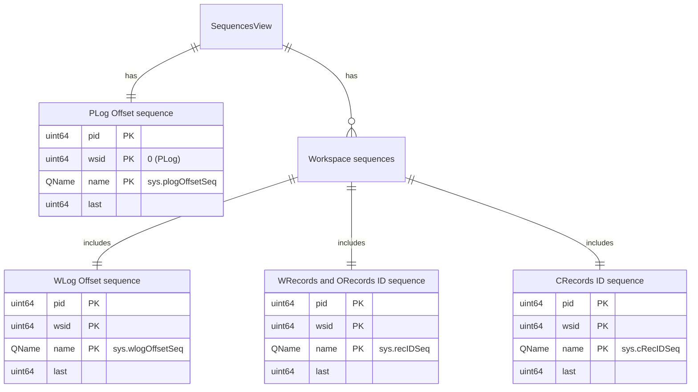

# Sequences

## Introduction

## Sequence view

### Structure

### Contens

### Sizes

**Overall record size:**

8 + 8 + 2 + 8 = **26** bytes.

**Max records per partition:**

Max Cassandra partition size is 20Mb.

Maximum 20 × 1024 × 1024 / 26 = **806’596** records per partition.

**Max sequences per workspace:**

Let we have 1’000 partitions.
Maximum 806’596 / 1’000= **806** sequences per workspace.

**Max workspaces per partition:**

Let we have only system sequences:

sys.plogOffsetSeq: 1
sys.wlogOffsetSeq, sys.recIDSeq, sys.cRecIDSeq: 3 per ws
Maximum (806’596 - 1) / 3 = **268’865** workspaces per partition.
