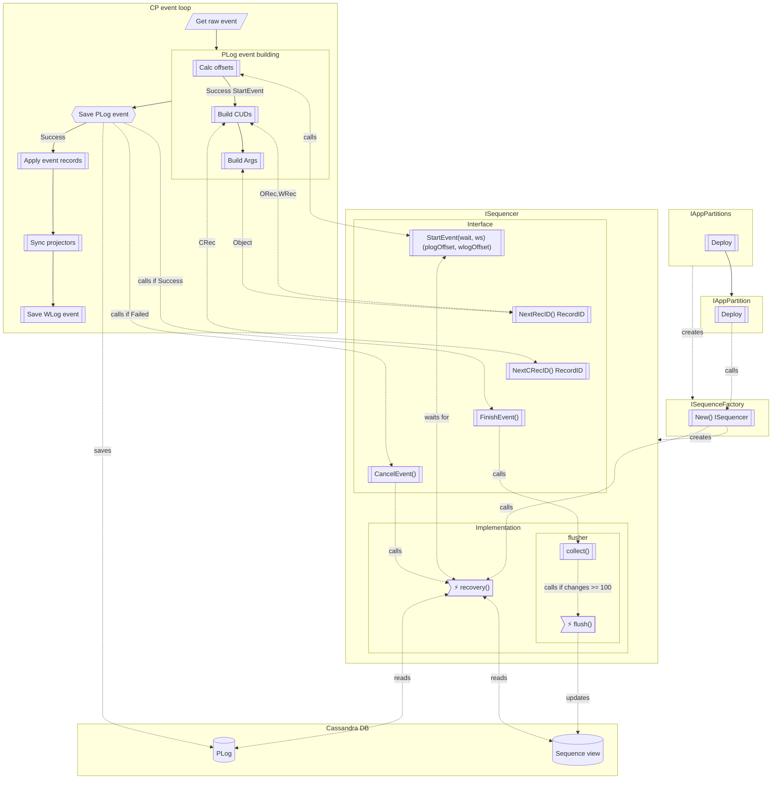

# Sequences

Sequence is a monotonic increasing list of numbers.

## Motivation

- [Sequences #3215](https://github.com/voedger/voedger/issues/3215)

## Requirements

QName for sequence view is defined in `appdef/sys`:

- `SequencesView`

QNames for sequences are defined in `appdef/sys`:

- `PLogOffsetSeq`
- `WLogOffsetSeq`
- `RecIDSeq`
- `CRecIDSeq`

Field names for sequences view are defined in `appdef/sys`:

- `SequencesView_PID`
- `SequencesView_WSID`
- `SequencesView_Name`
- `SequencesView_Last`

To access sequences `ISequencer` interface is used.
`ISequencer` defined in `sequences` package.
`ISequencer` implemented by `Sequencer` struct. `Sequencer` struct is defined in `sequences/sequencer` package.

## Components

- `pkg/sequence`
  - `ISequenceFactory`
  - `ISequencer`
  - `NewFactory(istructs.IAppStructs) ISequenceFactory`
- `pkg/sequences/internal/sequencer`
  - `Sequencer` supports `sequences.ISequencer`
  - `NewSequencer(istructs.IAppStructs) *Sequencer, cleanup func()`
- `pkg/appparts`
  - `IAppPartition.Sequencer() ISequencer`

## package `sequence`

### Interface `ISequenceFactory`

#### `sequences.NewFactory(str istructs.IAppStructs) ISequenceFactory`

- Actor: `appparts.IAppPartitions`
- When: application is deployed
- Flow:
  - Create a new `sequenceFactory` instance with `newSequenceFactory(str)`

#### `ISequenceFactory.New(pid istructs.PartitionID) (ISequencer, cleanup func())`

- Actor: `appparts.IAppPartition`
- When: app partition is deployed
- Flow:
  - Create new cancelable context `ctx` with `context.Background()`
  - return new `sequencer` instance and `cleanup` with `sequencer.NewSequencer(pid, str)`

### Interface `ISequence`

- `StartEvent(wait time.Duration, ws istructs.WSID) (plogOffset, wlogOffset istructs.Offset)`
  - Actor: CP
  - When: CP needs to process a request
- `NextRecID() istructs.RecordID`
  - Actor: CP
  - When: CP needs the next ODoc/ORecord or WDoc/WRecord ID
- `NextCRecID() istructs.RecordID`
  - Actor: CP
  - When: CP needs the next CDoc/CRecord ID
- `FinishEvent()`
  - Actor: CP
  - When: CP stores IPLogEvent
- `CancelEvent()`
  - Actor: CP
  - When: CP fail with IPLogEvent

### Flow control schema

## package `sequences/internal/sequencer`

### `NewSequencer(pid istructs.PartitionID, str istructs.IAppStructs) *Sequencer, cleanup func()`

- Create new cancelable context `ctx` with `context.Background()`
- Create a new `Sequencer` instance:
  - Set `ctx` to created `ctx`,
  - Set `pid` to `pid`,
  - Set `str` to `str`,
  - Set `flusher` to new instance with `newFlusher(ctx, pid, str)`
- Call `sequencer.recovery()`
- Return `sequencer` and `cleanup` function, which cancels `ctx` and calls `sequencer.wait()`

### Enumeration `sequencerStatus`

- `statusNone` (iota)
- `statusRecover`
- `statusReady`
- `statusEventing`
- `statusFinished`

### `Sequencer`

- Should supports `ISequencer` interface
- All methods of `ISequencer` interface should be called by CP synchronously, no need to use mutexes
- Fields:
  - `ctx context.Context`
  - `pid istructs.PartitionID`
  - `str istructs.IAppStructs`
  - `status atomic.Uint32`
  - `recoveryWG sync.WaitGroup`
  - `flusher flusher`
  - `plogOffset istructs.Offset`
  - `ws istructs.WSID`
  - `wlogOffset map[istructs.WSID]istructs.Offset`
  - `recID map[istructs.WSID]istructs.RecordID`
  - `cRecID map[istructs.WSID]istructs.RecordID`
- Methods:
  - `recovery()`
  - `wait()`

#### `Sequencer.StartEvent(wait time.Duration, ws istructs.WSID) (plogOffset, wlogOffset istructs.Offset)`

- Switch on `status`:
  - case `statusRecover`:
    - Wait for :
      - `recoveryWG` or
      - `wait` duration or
      - `ctx` is done
    - If ok (`status` is `statusReady`), 
      - then fall through to `statusReady`
      - else return (`istructs.NullOffset`, `istructs.NullOffset`)
  - case `statusReady`:
    - Set `status` to `statusEventing`
    - Set `ws`
    - Increment `plogOffset` and `wlogOffset[ws]` counters
    - Return (`plogOffset, wlogOffset[ws]`)
  - else panic

#### `Sequencer.NextRecID() istructs.RecordID`

- Check `status` is `statusEventing`. If not, panic
- Increment `recID[ws]` counter
- Return `recID[ws]`

#### `Sequencer.NextCRecID() istructs.RecordID`

- Check `status` is `statusEventing`. If not, panic
- Increment `cRecID[ws]` counter
- Return `cRecID[ws]`

#### `Sequencer.FinishEvent()`

- Check `status` is `statusEventing`. If not, panic
- Call `flusher.collect(plogOffset, ws, wlogOffset[ws], recID[ws], cRecID[ws])`
- Set `status` to `statusReady`

#### `Sequencer.CancelEvent()`

- Check `status` is `statusEventing`. If not, panic
- Call `recovery()`

#### `Sequencer.recovery()`

- Check `status` is `statusNone` or `statusEventing`, panic if not
- Set `status` to `statusRecover`
- Increment `recoveryWG`
- Starts go routine, which:
  - statusRecover cycle, repeatable:
    - while `flusher.active` wait for `flusher.active` is `false` or `ctx` done
    - Clear `plogOffset`, `wlogOffset`, `recID` and `cRecID` maps
    - Read system view `str.ViewRecords().Read(ctx, sys.Sequences, …)` with PK `pid`, for each `vr` record:
      - `ws := vr.AsInt64(sys.SequencesView_WSID)`
      - switch `vr.AsQName("Seq")` value:
        - case `sys.PLogOffsetSeq`:
          - `plogOffset = vr.AsInt64(sys.SequencesView_Last)`
        - case `sys.WLogOffsetSeq`:
          - `wlogOffset[ws] = vr.AsInt64(sys.SequencesView_Last)`
        - case `sys.RecIDSeq`:
          - `recID[ws] = vr.AsInt64(sys.SequencesView_Last)`
        - case `sys.CRecIDSeq`:
          - `cRecID[ws] = vr.AsInt64(sys.SequencesView_Last)`
    - Read PLog records using `str.Events().ReadPLog` starts from `plogOffset` to the end, for each passed to read `plogOffset` and `event`:
      - Remember new value of `plogOffset`,
      - `ws := event.WSID()`
      - For each `event.CUDs()` entry, if `cud.IsNew()`:
        - switch `appdef.Type(cud.QName()).Kind()`:
          - case `appdef.TypeKind_CDoc`, `appdef.TypeKind_CRecord`:
            - set `cRecID[ws]` to `cud.ID().BaseRecordID()` if `BaseRecordID` is greater than `cRecID[ws]`
          - case `appdef.TypeKind_ODoc`, `appdef.TypeKind_ORecord`, `appdef.TypeKind_WDoc`, `appdef.TypeKind_WRecord`:
            - set `RecID[ws]` to `cud.ID().BaseRecordID()` if `BaseRecordID` is greater than `RecID[ws]`
      - For `obj` from `event.Argument()` with children recursively:
        - set `RecID[ws]` to `obj.ID().BaseRecordID()` if `BaseRecordID` is greater than `RecID[ws]`
  - If error occurs and `ctx` is not done, then repeat recovery cycle
  - Set `status` to `statusReady`
  - Decrement `recoveryWG`

#### `Sequencer.wait()`

- If `status` is `statusRecovery` then
  - wait for `status` is `statusReady`
- else
  - If `flusher.changes` is not `nil` then call `flusher.flush()`
  - Wait for `flusher.active` is `false`
- Sets `status` to `statusFinished`

### `newFlusher(ctx context.Context, pid istructs.PartitionID, str istructs.IAppStructs)`

- Create a new `flusher` instance

### `flusher`

- Fields:
  - `ctx context.Context`
  - `pid istructs.PartitionID`
  - `str istructs.IAppStructs`
  - `active atomic.Bool`
  - `changes *changes`
  - `channel chan *changes`
  - `keys sync.Pool` of `istructs.IKeyBuilder`
    - Initialized to `sync.Pool{New: func() interface{} { return str.ViewRecords().NewKeyBuilder(sys.SequencesView) }}`
  - `values sync.Pool` of `istructs.IValueBuilder`
    - Initialized to `sync.Pool{New: func() interface{} { return str.ViewRecords().NewValueBuilder(sys.SequencesView) }}`
- Methods:
  - `collect(plogOffset istructs.Offset, ws istructs.WSID, wlogOffset istructs.Offset, recID, cRecID istructs.RecordID)`
  - `flush()`
  - `putBatch()`
  - `key(ws istructs.WSID, seq appdef.QName) istructs.IKeyBuilder`
  - `value(last uint64) istructs.IValueBuilder`
- Consts:
  - `flushChangesCount = 100`

#### `flusher.collect(plogOffset istructs.Offset, ws istructs.WSID, wlogOffset istructs.Offset, recID, cRecID istructs.RecordID)`

- If `changes` is `nil`, then:
  - Create a new `changes` instance
- `changes.plogOffset = plogOffset`
- `changes.wlogOffset[ws] = wlogOffset`
- `changes.recID[ws] = recID`
- `changes.cRecID[ws] = cRecID`
- `changes.count++`
- If not `active` and  `changes.count >= flushChangesCount`:
  - call `flush()`

#### `flusher.flush()`

- Set `active` to `true`
- `channel <- changes`
- `changes = nil`
- Call `go putBatch()`

#### `flusher.putBatch()`

- `changes = <-channel`
- `batchSize = len(changes.wlogOffset) * 3 + 1`
- `batch = make([]istructs.ViewKV, 0, batchSize)`
- for each `ws` in `changes.wlogOffset`:
  - append to `batch` new `istructs.ViewKV{}`:
    - `Key`: `key(ws, sys.WlogOffsetSeq)`
    - `Value`: `value(changes.wlogOffset[ws])`
  - if exists `changes.recID[ws]`, then:
    - append to `batch` new `istructs.ViewKV{}`:
      - `Key`: `key(ws, sys.RecIDSeq)`
      - `Value`: `value(changes.recID[ws])`
  - if exists `changes.cRecID[ws]`, then:
    - append to `batch` new `istructs.ViewKV{}`:
      - `Key`: `key(ws, sys.CRecIDSeq)`
      - `Value`: `value(changes.cRecID[ws])`
- append to `batch` new `istructs.ViewKV{}`:
  - `Key`: `key(istructs.NullWSID, sys.PlogOffsetSeq)`
  - `Value`: `value(changes.plogOffset)`
- repeat `str.ViewRecords().PutBatch(istructs.NullWSID, batch)` until success or context `ctx` done
- Set `active` to `false`

#### `flusher.key(ws istructs.WSID, seq appdef.QName) istructs.IKeyBuilder`

- `key = keys.Get().(istructs.IKeyBuilder)`
- `key.PutInt64(sys.SequencesView_PID, int64(pid))`
- `key.PutInt64(sys.SequencesView_WSID, int64(ws))`
- `key.PutQName(sys.SequencesView_Name, seq)`
- return `key`

#### `flusher.value(last uint64) istructs.IValueBuilder`

- `value = values.Get().(istructs.IValueBuilder)`
- `value.PutInt64(sys.SequencesView_Last, int64(last))`
- return `value`

### `changes` struct

- Fields:
  - `plogOffset istructs.Offset`
  - `wlogOffset map[istructs.WSID]istructs.Offset`
  - `recID map[istructs.WSID]istructs.RecordID`
  - `cRecID map[istructs.WSID]istructs.RecordID`
  - `count uint64`
